<p align="center">
  
</p>

<h1 align="center">MIA-BOT : THE MACHINE</h1>

<p align="center">
  <strong>Reinforcement Learning Agent for Rocket League</strong><br>
  <em>TorchScript CPU inference, multi-process simulation, and Bazel 9 builds.</em>
</p>

<p align="center">
  <a href="https://github.com/urban233/mia-bot-the-machine/actions"></a>
  <a href="https://www.python.org/"></a>
  <a href="https://pytorch.org/"></a>
  <a href="https://rlbot.org/"></a>
  <a href="https://github.com/AechPro/rlgym-ppo"></a>
  <a href="LICENSE"></a>
</p>

<p align="center">
  <a href="#-system-overview">Overview</a> •
  <a href="#-neural-architecture--topology">Architecture</a> •
  <a href="#-quick-start-workflows">Quick Start</a> •
  <a href="#-training-hud--telemetry">Training HUD</a> •
  <a href="#-skill-milestones--elo-matrix">Skill Matrix</a> •
  <a href="#-cli-reference">CLI Reference</a> •
  <a href="#-project-blueprint">Blueprint</a>
</p>

---

## ⚡ System Overview

**MIA-BOT: The Machine** is a Rocket League bot trained with continuous **Proximal Policy Optimization (PPO)** in headless simulation environments (`rlgym-sim` and `RocketSim`). 

Inference runs in-game on CPU using a JIT-traced **TorchScript** policy inside the RLBot framework. Builds, tests, container images, and release packages are managed hermetically with **Bazel 9**.

```
                  ┌────────────────────────────────────────┐
  GAME STATE ───► │  89-Dim Observation Tensor (Normalized)│
                  └──────────────────┬─────────────────────┘
                                     │
                                     ▼
                  ┌────────────────────────────────────────┐
                  │   3-Layer Deep MLP Actor (256x256x256) │
                  │   TorchScript JIT Forward Pass (CPU)   │
                  └──────────────────┬─────────────────────┘
                                     │
                                     ▼
                  ┌────────────────────────────────────────┐
  CONTROLS   ◄─── │  Continuous Controller Vector (8-Dim)  │
                  └────────────────────────────────────────┘
```

### 🛠️ Architecture Highlights

* **Hermetic Monorepo (Bazel 9 & Bzlmod)**: Builds, tests, and packaging are isolated and reproducible using pinned Python 3.11 toolchains, `rules_python`, `rules_oci`, and `rules_pkg`.
* **TorchScript CPU Inference**: The trained actor network is exported to a standalone `policy.pt` model for in-game execution without training dependencies.
* **Parallel Physics Simulation (RocketSim IPC)**: Multi-process headless environment simulation running at ~1,500 steps/sec per worker.
* **Symmetric Coordinate Invariance**: Automatic frame-of-reference inversion ensures identical policy execution on both Blue and Orange teams.
* **Training Telemetry & Checkpoints**: Heuristic MMR tracking, interactive keyboard controls (`[p]` pause, `[c]` save, `[q]` exit), and automatic checkpoint rotation.

---

## 🧠 Neural Architecture & Topology

MIA-BOT ingests the game environment as an **89-dimensional continuous feature vector**, normalized relative to standard field dimensions and velocities.

```mermaid
flowchart LR
    subgraph Inputs["In-Game Telemetry (89-D)"]
        direction TB
        B["Ball Kinematics (9D)<br>• Position (x,y,z)<br>• Velocity (x,y,z)<br>• Angular Vel (x,y,z)"]
        S["Self Car State (16D)<br>• Position & 3x3 Rotation<br>• Linear & Angular Vel<br>• Boost, Ground, Demolished"]
        O["Other Players (Up to 64D)<br>• Relative Positions & Rots<br>• Relative Velocities<br>• State & Boost Flags"]
    end

    subgraph PolicyNetwork["Actor Policy Network (TorchScript JIT)"]
        direction TB
        L1["Linear (89 → 256) + ReLU"]
        L2["Linear (256 → 256) + ReLU"]
        L3["Linear (256 → 256) + ReLU"]
        L4["Linear (256 → 16)<br>8 Means + 8 Stds"]
        L1 --> L2 --> L3 --> L4
    end

    subgraph Outputs["Controller State"]
        direction TB
        C1["Pitch / Yaw / Roll / Steer / Throttle (-1.0 to 1.0)"]
        C2["Jump / Boost / Handbrake (Boolean Thresholds)"]
    end

    Inputs --> L1
    L4 -->|"Slice Mean Tensor [:8]"| Outputs
```



### Observation Vector Breakdown (89 Features)

| Feature Slice | Dimensions | Description | Normalization Constant |
| :--- | :--- | :--- | :--- |
| `obs[0:9]` | **9** | Ball Position, Linear Velocity, Angular Velocity | $\text{POS} = 2300, \text{VEL} = 2300, \omega = \pi$ |
| `obs[9:25]` | **16** | Self Car Position, $3\times3$ Orientation Matrix, Velocities, Boost %, Flags | Normalized & Team-Mirrored |
| `obs[25:89]` | **64** | Ordered Teammate & Opponent States (16 dimensions $\times$ up to 4 cars) | Zero-padded if fewer cars present |

---

## 🚀 Quick Start Workflows

Choose the execution track that matches your workflow:

```
├── Track A: Bazel 9 Hermetic Pipeline ──► (Production / CI / Packaging)
├── Track B: Docker GPU Container     ──► (Maximum Training Throughput)
└── Track C: Standalone Python (uv)   ──► (Rapid Iteration / Development)
```

---

### Track A: Bazel 9 Hermetic Pipeline (Recommended)

Bazel orchestrates tests, compilation, tracing, container builds, and packaging in a completely isolated environment.

#### 1. Execute the Automated Test Suite
Runs unit, integration, and end-to-end pipeline verification (math verification, observation normalization, checkpoint rotation, and TorchScript export):

```bash
bazel test //...
```

#### 2. Launch Headless GPU/CPU Training
```bash
bazel run //:train -- --resume --n-proc 12
```

#### 3. Export Checkpoints to TorchScript Policy
```bash
bazel run //:export -- --checkpoints-dir data/checkpoints --output policy.pt
```

#### 4. Build RLBot Release Bundles
Compiles hermetic zip and tar.gz release distributions for the RLBot GUI:

```bash
bazel build //:bot_bundle_zip //:bot_bundle_tar
# Release artifact generated at: bazel-bin/mia_bot.zip
```

#### 5. Build & Load Training OCI Container
```bash
bazel run //container:training_tarball
```

---

### Track B: Docker GPU Acceleration (WSL2 / Linux)

For isolated, multi-worker training with dedicated CUDA support and shared memory IPC:

#### Native Shell Script (Linux / WSL2)
```bash
chmod +x ./docker/docker-run.sh
./docker/docker-run.sh --resume --n-proc 12
```

#### Docker Compose
```bash
# Build the training layer
docker compose -f docker/docker-compose.yml build

# Start interactive training session
docker compose -f docker/docker-compose.yml run --rm train --n-proc 12

# Export policy from container
docker compose -f docker/docker-compose.yml run --rm export
```

#### Windows PowerShell
```powershell
.\docker\docker-run.ps1 -PassthroughArgs "--resume", "--n-proc", "12"
```

---

### Track C: Standalone `uv` Prototyping

For fast, lightweight Python-only execution without Bazel or Docker:

```bash
# 1. Sync dependencies into virtualenv
uv sync

# 2. Start training
uv run python -m mia_bot.train --n-proc 10

# 3. Export policy
uv run python -m mia_bot.export

# 4. Generate local bundle
uv run python -m mia_bot.bundle
```

#### Deploy to RLBot GUI
1. Launch **RLBot GUI** (v4 or v5).
2. Click **Add** $\rightarrow$ **Load Folder** and select `dist/mia_bot` (or load `bazel-bin/mia_bot.zip`).
3. Add `MIA_Bot` to any team and start the match.

---

## 📊 Training HUD & Telemetry

`mia_bot.train` features an interactive terminal display tracking real-time convergence, heuristic Elo ratings, and estimated times to mechanics discovery:

```text
┌──────────────────────────────────────────────────────────────────────────────┐
│                            MIA-BOT RANK PROGRESS                             │
├──────────────────────────────────────────────────────────────────────────────┤
│  Current Steps :   78,450,000 steps                                          │
│  Estimated Rank: Champion                 (Heuristic MMR: 1200 - 1500)       │
│  Current Focus : Fast aerials & backpost defense                             │
│  Next Rank     : Grand Champion (71,550,000 steps left | ~14h 43m)           │
│  Rank Progress : [███████████████░░░░░░░░░░░░░░░]  52.3%                     │
└──────────────────────────────────────────────────────────────────────────────┘
```

### 🎮 Interactive Hotkeys (Training Mode)

| Hotkey | Action | Behavior |
| :---: | :--- | :--- |
| <kbd>p</kbd> + <kbd>Enter</kbd> | **Pause / Resume** | Temporarily halts environment stepping without dropping GPU context. |
| <kbd>c</kbd> + <kbd>Enter</kbd> | **Force Save** | Immediately flushes current policy and state tensors to disk. |
| <kbd>q</kbd> + <kbd>Enter</kbd> | **Graceful Shutdown** | Finishes current batch iteration, saves model checkpoint, and safely exits. |

---

## 🎯 Skill Milestones & ELO Matrix

*Performance baseline tested on: 12 CPU Workers + NVIDIA RTX 40-Series (~1,500 steps/sec $\approx$ 5.4M timesteps/hour)*

```
 0M ── Rookie ──────► 5M ── Gold ──────► 35M ── Diamond ──────► 150M ── Grand Champ ──────► 300M+ (SSL)
 [Ground Touch]       [Net Defense]     [Wall Reads]          [Air Dribbles]         [Flip Resets]
```

| Target Tier | Step Range | Approx. Runtime | Observable Behaviors & Mechanics Discovered |
| :--- | :---: | :---: | :--- |
| **Bronze / Silver** | 2M – 5M | ~30 – 60 min | Ball-seeking, reliable ground challenges, basic trajectory alignment. |
| **Gold / Platinum** | 10M – 25M | ~2 – 5 hours | Net aiming, goal-line saves, single-jump aerial challenges, basic recoveries. |
| **Diamond / Champion** | 50M – 100M | ~10 – 20 hours | Fast aerials, wall rebounds, backpost rotations, small boost pad routing. |
| **Grand Champion** | 150M – 250M | ~30 – 50 hours | Air dribbles, double taps, consistent flick executions, passing awareness. |
| **Supersonic Legend** | 300M – 500M+ | ~60 – 100+ hours | Flip resets, ceiling shots, speed-flip kickoffs, zero-hesitation read defense. |

---

## ⚙️ CLI Reference

```bash
bazel run //:train -- [FLAGS]
# or: uv run python -m mia_bot.train [FLAGS]
```

| Parameter | Type | Default | Description |
| :--- | :---: | :---: | :--- |
| `--resume`, `-r` | `flag` | `False` | Automatically discovers and restores the latest checkpoint folder. |
| `--save-every` | `int` | `100_000` | Timestep interval between automated checkpoint saves. |
| `--max-checkpoints` | `int` | `3` | Maximum number of rotating checkpoints retained before pruning. |
| `--n-proc` | `int` | `10` | Number of parallel worker processes executing `RocketSim` physics. |
| `--render` | `flag` | `False` | Enable diagnostic rendering mode (when supported by simulation host). |

---

## 📁 Project Blueprint

```text
mia-bot-the-machine/
├── .bazelrc                   # Hermetic compiler flags & execution profiles
├── .bazelversion              # Pinned Bazel release (9.2.0)
├── MODULE.bazel               # Bzlmod dependencies (rules_python, rules_pkg, rules_oci)
├── BUILD.bazel                # Root build targets, release packaging & aliases
├── pyproject.toml             # Python package configuration (PEP 621 / uv)
├── requirements_lock.txt      # Hermetically locked dependencies for Bazel
├── bot.cfg                    # RLBot agent metadata & entrypoint configuration
├── appearance.cfg             # Car customization (Metallic Cyan/Gold Pin-Bot theme)
├── policy.pt                  # Traced TorchScript actor weights (CPU inference)
│
├── src/mia_bot/               # Core Application Package
│   ├── BUILD.bazel            # Target definitions for bot, train, export, bundle
│   ├── bot.py                 # In-game inference agent with runfiles resolution
│   ├── train.py               # Headless PPO multi-worker training engine
│   ├── export.py              # TorchScript JIT tracing & model extractor
│   ├── bundle.py              # RLBot distribution packager
│   └── main.py                # Smoke-test CLI entry point
│
├── docker/                    # GPU Containerization
│   ├── Dockerfile             # Multi-stage CUDA-accelerated training image
│   ├── docker-compose.yml     # Compose stack for training & policy export
│   ├── docker-run.sh          # Linux / WSL2 launcher script
│   └── docker-run.ps1         # Windows PowerShell launcher script
│
├── container/                 # OCI Rules
│   └── BUILD.bazel            # rules_oci image definitions
│
├── tests/                     # Automated Test Suite
│   ├── BUILD.bazel            # Bazel py_test test suite definitions
│   ├── test_math.py           # Euler to rotation matrix transformations
│   ├── test_observation.py    # 89-D feature extraction & team coordinate mirroring
│   ├── test_checkpoints.py    # Automatic checkpoint rotation & pruning logic
│   ├── test_policy_model.py   # Neural actor forward pass & tensor slicing
│   ├── test_bundle.py         # Distribution bundle verification
│   └── test_e2e_pipeline.py   # Full training-to-TorchScript integration test
│
└── assets/                    # Media & Vector Graphics
    └── logo.svg               # Cybernetic Pin-Bot HUD vector emblem
```

---

## 🧪 Verification & Continuous Integration

Every commit is tested against the hermetic **Bazel 9 CI Pipeline** on GitHub Actions:

```
┌─────────────────────────────────────────────────────────────┐
│                       CI PIPELINE                           │
├─────────────────┬───────────────────┬───────────────────────┤
│  1. Unit Tests  │  2. Policy Tracing│  3. Bundle Packaging  │
│  bazel test     │  Export to JIT    │  Build .zip / .tar.gz │
│  (All Suites)   │  Verification     │  Artifact Upload      │
└─────────────────┴───────────────────┴───────────────────────┘
```

Run tests locally at any time:
```bash
bazel test //tests:... --test_output=errors
```

---

## ⚖️ License

Distributed under the **BSD-3-Clause License**. See [`LICENSE`](LICENSE) for terms of use and distribution.
