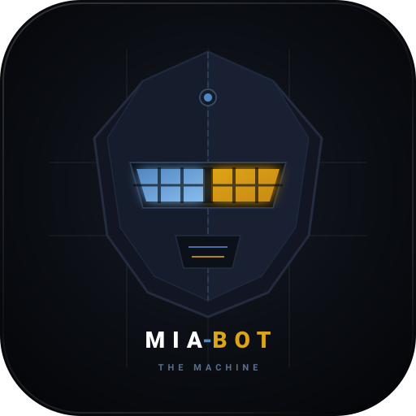

<p align="center">
  
</p>

<h1 align="center">MIA-BOT: The Machine</h1>

A standalone, reinforcement learning-driven Rocket League agent trained with `rlgym-sim` and `rlgym-ppo`, optimized for CPU inference and deployment via RLBot.

---

## Prerequisites

* **Python 3.11**
* **[uv](https://github.com/astral-sh/uv)** package manager
* **NVIDIA GPU** with CUDA support
* **[RLBot GUI](https://rlbot.org/)** (v4 / classic)

---

## Quick Start Workflow

**1. Install dependencies:**

```powershell
uv sync

```

**2. Train the bot:**

```powershell
uv run .\train.py

```

**3. Export trained policy to TorchScript:**

```powershell
uv run .\export.py

```

**4. Bundle files for distribution:**

```powershell
uv run .\bundle.py

```

**5. Play in RLBot:**

* Open **RLBot GUI**.
* Click **Add** $\rightarrow$ **Load Folder** and select `dist/mia_bot` (or load `dist/mia_bot.zip`).
* Add `ML_Demon_Bot` to a team and click **Start Match**.

---

## Training CLI Flags & Options

`train.py` supports configurable arguments for automated checkpointing, auto-resuming, and parallel worker allocation:

```powershell
uv run .\train.py [OPTIONS]

```

| Flag | Type | Default | Description |
| --- | --- | --- | --- |
| `--resume`, `-r` | `flag` | `False` | Automatically finds and resumes from the highest-step checkpoint across all previous runs. |
| `--save-every` | `int` | `100_000` | Timestep interval between saving checkpoints (~1–2 minutes at 1.5k ts/s). |
| `--max-checkpoints` | `int` | `3` | Maximum number of concurrent checkpoint folders to retain before automatically pruning older ones. |
| `--n-proc` | `int` | `10` | Number of parallel CPU simulation processes running physics workers. |

### Example Commands

* **Start a fresh training run:**
```powershell
uv run .\train.py

```


* **Resume seamlessly from the latest saved checkpoint:**
```powershell
uv run .\train.py --resume

```


* **Save checkpoints every 250k steps and keep the last 5:**
```powershell
uv run .\train.py --resume --save-every 250000 --max-checkpoints 5

```


* **Run with 16 parallel CPU workers:**
```powershell
uv run .\train.py --resume --n-proc 16

```


### Interactive Terminal Controls

While `train.py` is running, enter commands into the terminal:

* **`p` + Enter**: Pause / unpause environment stepping.
* **`c` + Enter**: Force an immediate checkpoint save.
* **`q` + Enter**: Save a checkpoint and cleanly exit after the current iteration.

---

## Skill Milestones & Estimated Runtimes

*Hardware baseline: 10 CPU workers + RTX 4060 (~1,500 ts/s $\approx$ 5.4M timesteps/hour)*

| Target Skill Level | Timestep Range | Est. Training Time | Observable Mechanics |
| --- | --- | --- | --- |
| **Bronze / Silver** | 2M – 5M | ~30 – 60 min | Drives toward ball, consistent ground hits, stops wall-circling. |
| **Gold / Platinum** | 10M – 25M | ~2 – 5 hours | Accurate net shots, basic single-jump challenges, goal line defense. |
| **Diamond / Champion** | 50M – 100M | ~10 – 20 hours | Fast aerials, wall rebounds, backpost rotations, boost pickup logic. |
| **Grand Champion / SSL** | 250M – 500M+ | ~48 – 100+ hours | Air dribbles, flip resets, fast kickoffs, ceiling shots. |

---

## Docker Training (WSL2 / Linux)

Training `rlgym-sim` inside Docker under WSL2 offers **5%–15% faster simulation throughput** due to lower Linux IPC and CPU process-forking overhead.

### Docker Prerequisites
* **WSL2** with updated Linux kernel (`wsl --update`).
* **NVIDIA Driver** on host with CUDA support.
* **NVIDIA Container Toolkit** or Docker Desktop with WSL2 GPU integration enabled.

### 1. Build the Docker Image
```bash
docker compose build
# Or directly:
docker build -t mia-bot-train:latest .
```

### 2. Run Training with Docker Compose
```bash
# Start/resume training in interactive mode with GPU acceleration:
docker compose run --rm train

# Pass custom arguments:
docker compose run --rm train --n-proc 14 --save-every 100000 --max-checkpoints 5
```

### 3. Run with Helper Scripts or Docker CLI

**Linux / WSL2 bash:**
```bash
chmod +x ./docker-run.sh
./docker-run.sh --resume --n-proc 12
```

**Windows PowerShell:**
```powershell
.\docker-run.ps1 -PassthroughArgs "--resume", "--n-proc", "12"
```

**Direct `docker run` command:**
```bash
docker run --rm -it \
    --gpus all \
    --shm-size 2gb \
    -v $(pwd)/data:/app/data \
    mia-bot-train:latest --resume --save-every 100000 --max-checkpoints 3
```

### 4. Export Policy via Docker
```bash
docker compose run --rm export
```

---

## Project Structure

```text
mia-bot/
├── .dockerignore        # Docker build context exclusions
├── appearance.cfg       # Car cosmetics and paint finish
├── bot.cfg              # RLBot metadata and configuration
├── bot.py               # Standalone in-game inference agent
├── bundle.py            # Distribution packager (creates dist/ and .zip)
├── docker-compose.yml   # Multi-service Docker orchestrator (train / export)
├── docker-run.ps1       # PowerShell Docker launcher with GPU pass-through
├── docker-run.sh        # Bash/WSL2 Docker launcher with GPU pass-through
├── Dockerfile           # GPU-accelerated Linux training container definition
├── export.py            # Traces PyTorch checkpoint into TorchScript policy.pt
├── policy.pt            # Exported actor model weights
├── pyproject.toml       # Python dependencies configuration
├── requirements.txt     # In-game runtime dependencies for RLBot GUI
├── train.py             # Headless PPO training script
└── data/checkpoints/    # Auto-rotated model checkpoints
```
